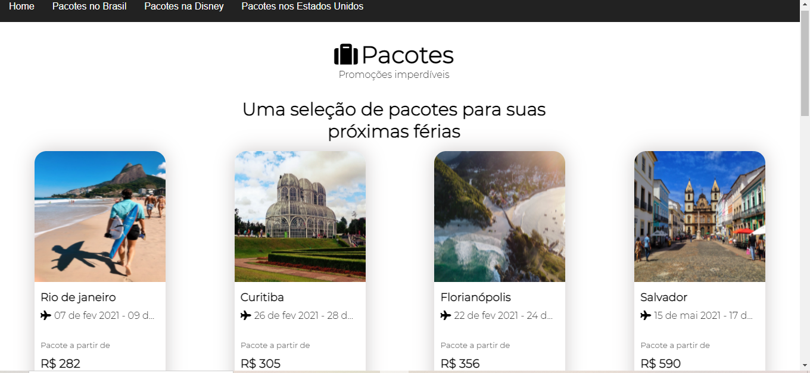

# Pacotes de viagens

Um site de pacotes de viagens

## Sobre o Projeto

Este projeto consiste em mostrar pacotes de viagens

## Demonstração do projeto

Foto do projeto

Resultado final: https://sad-meninsky-18cc68.netlify.app/

## Objetivo do projeto

Projeto desenvolvido para treinar React Components

## Tecnologias Usadas no projeto

Projeto feito utilizando as seguintes linguagens/tecnologias: 

* React.js

## Instalação

Para que este projeto rode em sua máquina, siga os passos abaixo:

Clone este repositório em uma pasta em sua máquina  
$ git clone https://github.com/Leveditor/pacotes.git

Entre na pasta  
$ cd pacotes

Instale as dependencias digitando no termimal:  
$ npm install

Rode a aplicação no modo de desenvolvimento.  
$ npm start

Abra a porta http://localhost:3000 no seu navegador para visualizar o projeto